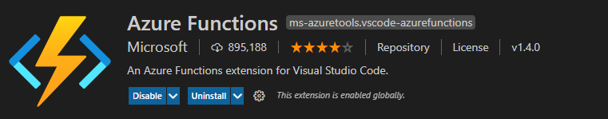
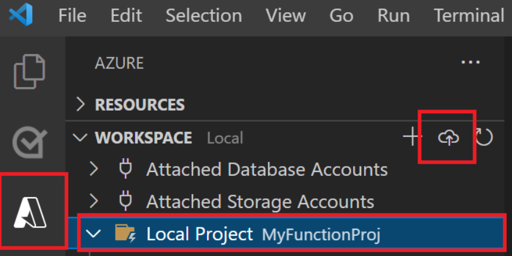

# Ingesting Data with Azure Functions

The main goal of this repository is demonstrate how you can use Azure Functions to ingest data into your Azure Data Lake.

## Requirements
* Terraform (for infra setup)
* Azure CLI (for infra setup)
* VSCODE with Azure Functions extension
* Python 3.8

**Note:** You can either use the Azure Functions Core Tools to test, but most of people aren't allowed to install on their company machine



## Ingestion logic

Are used `requests` and `azure.storage.filedatalake` libs to read from the API and write it on Data lake.

For more information please check: [ingestion code](./Functions/data-ingestion/api_el.py)

**Note:** Azure Function context is read-only, to handle the data is used `io` lib to make it in memory

## How to use

Azure Function generate an end-point to make requests and activate the function, this is a good way to integrate with [Azure Data Factory](https://docs.microsoft.com/en-us/azure/data-factory/control-flow-azure-function-activity).

### Sample Request

Get request
```
GET <Az-Function-endpoint>
```

Response
```
{
    "docs": """
    API Extract and Load
    GET: Will get this menssage
    POST: Will ingest the json from a API content if the following body is posted
    {
        "api_name": "<api-name>",
        "url": "<end-point-url>"
    }
    api_name: need to be a path like
    """
}
```

Post request
```
POST <Az-Function-endpoint>
```

Body
```
{
    "api_name": "nubank",
    "url": "https://dadosabertos.nubank.com.br/taxasCartoes/itens"
}
```

Response
```
{
    "status": "success",
    "menssage": "raw/nubank/nubank_1662750895.json"
}
```

# Steps to reproduce

## Clone repo

```
git clone https://github.com/otacilio-psf/azure-functions-ingestion
cd azure-functions-ingestion
```

## (Optional) Create Infrastructure

Follow README inside IaC

## Deploy function to Azure

Some requirements are expected and created by IaC routine:

- Service Princial with Storage Blob Data Contributor on your Data lake
- Azure Funtions resource created
- Tenant Id, Sp Id Sp secret, Storage Acc name and Cointaner name as Environment variables
  - [How to config 1](https://docs.microsoft.com/en-us/azure/app-service/app-service-key-vault-references) and [How to config 2](https://azure.microsoft.com/en-us/blog/simplifying-security-for-serverless-and-web-apps-with-azure-functions-and-app-service)

### Steps

1. Open VSCODE on Functions folder
2. Click on Azure extension > Local Project > Deploy
3. Follow the options:
    - Login if you haven't
    - Select the Function app
    - Click on confirmation



### Automate deployment

We can use Github Actions to Continuous delivery our Azure Function, please check [docs](https://docs.microsoft.com/en-us/azure/azure-functions/functions-how-to-github-actions?tabs=python).